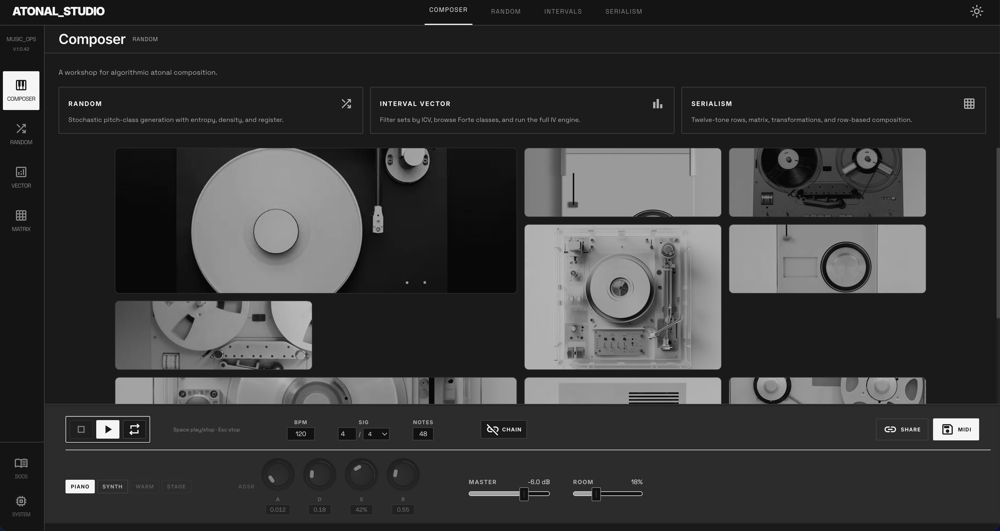
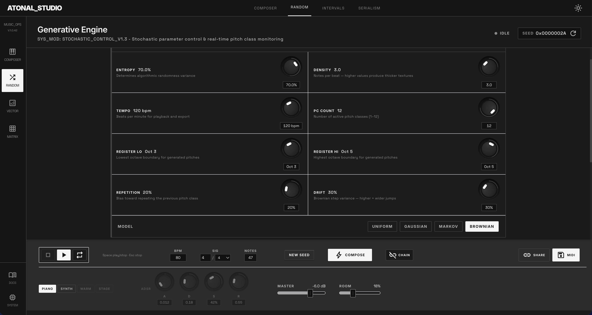
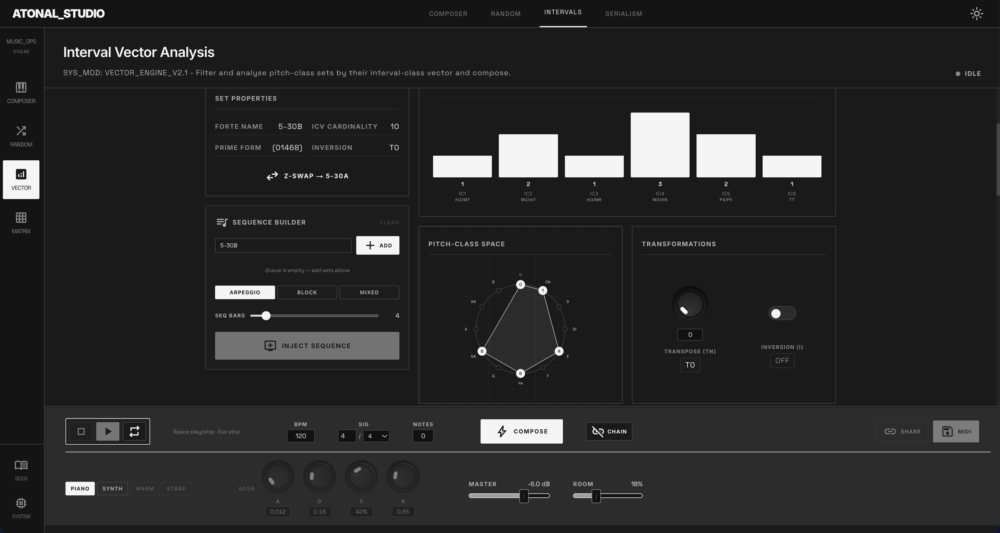
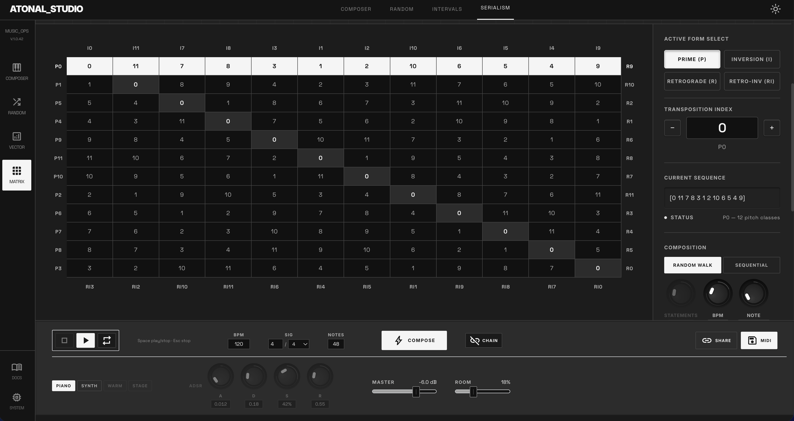
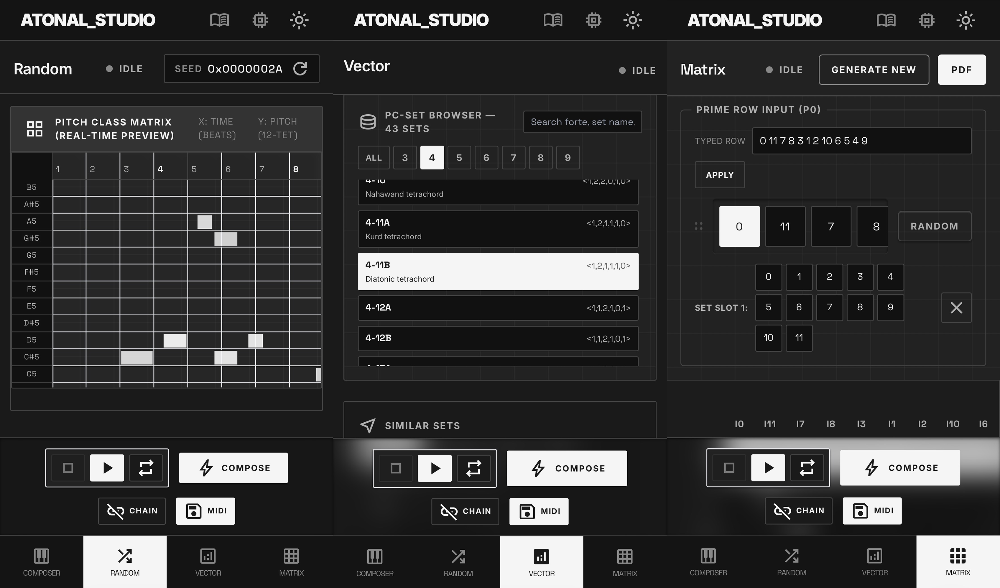

# Atonal Studio

**Atonal Studio** is a workshop for atonal composition, built on pitch-class set theory. The app lets you generate, analyse, and export atonal music using several compositional models — stochastic generation, interval-class vector similarity, and twelve-tone serialism.

---

## UI






#### Mobile Views



## Table of Contents

1. [Theory Background](#theory-background)
2. [Views](#views)
3. [Local Setup](#local-setup)
4. [Algorithm Notes](#algorithm-notes)
5. [Literature](#literature)

---

## Theory Background

### Pitch Classes and Equal Temperament

Atonal music abandons a tonal centre, treating all twelve pitch classes of the chromatic scale as equally available. A **pitch class** (PC) is an integer 0–11 representing a note regardless of octave: C/B♯ = 0, C♯/D♭ = 1, D = 2, …, B/C♭ = 11.

The pitches derive from **twelve-tone equal temperament (12-TET)**, in which the octave is divided into twelve equal semitones. The frequency of the _n_-th semitone above a reference pitch $f_0$ is:

$$f_n = f_0 \cdot \left(2^{1/12}\right)^n$$

Using A4 = 440 Hz as the standard reference (ISO 16), every other pitch is calculated by applying this formula. Equal temperament distributes the inevitable acoustic "tempering" (the compromise between pure harmonic ratios and the practicality of a fixed-pitch instrument) evenly across all twelve intervals, as opposed to historical tuning systems such as meantone or Pythagorean, which favour certain intervals at the expense of others.<sup>1</sup>

### Pitch-Class Set Theory

**Pitch-class set theory**, formalised by Allen Forte (1973), provides a rigorous language for analysing and constructing atonal music:

| Concept                         | Definition                                                                                                                                                                                                                                         |
| ------------------------------- | -------------------------------------------------------------------------------------------------------------------------------------------------------------------------------------------------------------------------------------------------- |
| **Pitch-class set**             | An unordered collection of PCs, e.g. {0, 4, 7} (major triad).                                                                                                                                                                                      |
| **Normal form**                 | The most compact, left-packed ordering of a PC set; used for canonical comparison.                                                                                                                                                                 |
| **Prime form**                  | The most compact normal form across all transpositions and inversions. Forte labels (e.g. 3-11) index all 352 distinct prime forms.                                                                                                                |
| **Interval-class vector (ICV)** | A six-entry tally ⟨ic1, ic2, ic3, ic4, ic5, ic6⟩ counting how many pairs produce each interval class (ic1 = semitone, ic6 = tritone).                                                                                                              |
| **Z-relation**                  | Two sets with identical ICVs but different prime forms — they sound similar yet are structurally distinct.                                                                                                                                         |
| **Operations**                  | Tₙ (transposition by n semitones), Iₙ (inversion), Complementation (S<sup>_c_</sup>), Multiplication (M), R (retrograde), RIₙ (retrograde-inversion). Transposition and inversion preserve the ICV. R and RIₙ are available only for ordered sets. |

---

## Views

### Composer

The home interface. After generating a composition in any of the three engine views, it can be viewed in the playback bar, which is available in all views. The playback bar is the only functionality in the Composer view. The playback bar provides:

- **Audio engine** — Switch between a sampled grand piano (Salamander) and two synthesiser presets (Synth, Stage).
- **ADSR envelope** — Attack, Decay, Sustain, Release controls for the synthesiser voices.
- **Reverb** — Room slider.
- **Transport** — Play, Stop, Loop toggle, BPM display, and time signature selection. The time signature is a rhythm calculation side-effect which means that the notes don't necessarily land on beat boundaries.
- **MIDI export** — Download the composition as a standard MIDI file.
- **Share link** — Encodes the composition in a URL for sharing.

### Random (Generative Engine)

Generates pitch-class sequences stochastically. Parameters include:

- **Density** — Notes per bar.
- **Register range** — Octave span for note placement (the only view where register is manually selectable).
- **Entropy** — Algorithmic randomness variance.
- **Repetition** — Controls the likelihood of repeating previous notes.
- **Drift** — In Brownian mode, controls the step variance.

Several generation models are available (Gaussian, Markov-influenced, etc.). Output updates in a real-time piano-roll preview.

### Vector (Interval Vector Analysis/Engine)

Analyses pitch-class sets by their interval-class vector and composes music using ICV-based filtering. Features:

- **Set browser** — Browse all 352 Forte prime forms, filtered by IC weight, cardinality, or ICV similarity to a target set.
- **Distance metrics** — Seven measures comparing ICV similarity: Manhattan (Morris SIM), Euclidean, ICVSIM (Isaacson), Cosine, Minkowski (p=3), ASIM (Morris), and ATMEB (Rahn/Isaacson). Forte's ordinal similarity relations (R0, R1, R2) are also shown.
- **2D / 3D visualisations** — Plots all prime forms in ICV space under the selected metric, using PCA for the 3D projection.
- **Sequence Builder** — Manually chain sets by ICV similarity to construct a progression. Texture options: arpeggio, block chord, or mixed.

### Matrix (Twelve-Tone Serialism)

Constructs and analyses twelve-tone rows:

- **Row entry** — Enter any ordering of the 12 pitch classes as a tone row.
- **14 × 14 matrix** — Displays all 48 classical row forms: Prime (P), Inversion (I), Retrograde (R), and Retrograde-Inversion (RI), each transposed to all 12 levels, plus row and column labels.
- **Row highlighting** — Active forms are highlighted in the matrix, with the current sequence also shown.
- **Composition** — Generates music by chaining selected row forms with configurable rhythm and register parameters.
- **Export** — Download the twelve-tone matrix as a PDF or CSV.

---

## Local Setup

**Requirements:** Node.js ≥ 18

```bash
# Clone the repository
git clone https://github.com/your-username/atonal.git
cd atonal/src

# Install dependencies
npm install

# Start the development server (accessible on all network interfaces)
npm run dev
```

The app runs at [http://localhost:3000](http://localhost:3000).

To test on a mobile device on the same network, use your machine's local IP address, e.g. `http://192.168.x.x:3000`.

### Other Scripts

| Command              | Purpose                                   |
| -------------------- | ----------------------------------------- |
| `npm run build`      | Production build                          |
| `npm run start`      | Serve the production build                |
| `npm run lint`       | Biome linter/formatter check              |
| `npm run test`       | Run Vitest unit tests                     |
| `npm run build:data` | Regenerate the pitch-class set data files |

### Tech Stack

| Library        | Version   | Role                               |
| -------------- | --------- | ---------------------------------- |
| Next.js        | 14        | App framework (App Router)         |
| React          | 18        | UI                                 |
| TypeScript     | 5         | Type safety                        |
| Tailwind CSS   | 3         | Styling                            |
| Tone.js        | 15        | Web Audio synthesis and scheduling |
| @tonejs/midi   | 2         | MIDI export                        |
| D3             | 7         | 2D visualisations                  |
| Three.js / R3F | 0.171 / 8 | 3D ICV visualisation               |
| Zustand        | 5         | Global state                       |
| ml-pca         | 4         | PCA for 3D projection              |
| jsPDF          | 2         | PDF export                         |

---

## Algorithm Notes

### Register Selection

- **Random view**: Register (octave range) is manually configurable via the parameter dials.
- **Vector and Matrix views**: Register is determined algorithmically. The engine selects octaves based on set cardinality and the pitch-class content of each chord/event, spreading voices across registers to avoid clustering.

### Chain Mode

All three engine views include a **Chain** toggle in the playback bar. When enabled, newly generated compositions are appended to the existing composition rather than replacing it. This allows incremental construction of longer pieces by chaining outputs from any combination of engines.

### Distance Measures (Vector View)

The seven ICV distance measures are detailed in the in-app documentation panel (open via the menu book icon). In brief:

- **Manhattan / Morris SIM** — Sum of absolute differences. The canonical atonal similarity measure.
- **Euclidean** — Standard geometric distance; used as the basis for PCA.
- **ICVSIM (Isaacson 1990)** — Standard deviation of the element-wise difference vector; cardinality-neutral.
- **Cosine** — Measures angular separation; useful when relative interval proportions matter more than absolute counts.
- **Minkowski p=3** — Emphasises the worst-matching interval classes more than Euclidean.
- **ASIM (Morris)** — Normalises Manhattan by combined cardinality; comparable across set sizes.
- **ATMEB (Rahn/Isaacson)** — Asymmetric embeddability: how well one set's harmonic character fits within another.

---

## Literature

- Allen Forte, [_The Structure of Atonal Music_](https://archive.org/details/structureofatona0000fort), Yale University Press, 1973.
- Philippe Guillaume, _Music and Acoustics: From Instrument to Computer_, ISTE, 2007.
- Robert D. Morris, _Composition with Pitch Classes: A Theory of Compositional Design_, Yale University Press, 1987.
- George Perle, [_Serial Composition and Atonality_](https://archive.org/details/serialcompositio0006edperl/mode/2up), University of California Press, 6th ed., 1991.
- John Rahn, [_Basic Atonal Theory_](https://archive.org/details/basicatonaltheor0000rahn), Schirmer Books, 1980.
- Michiel Schuijer, _Analyzing Atonal Music: Pitch-Class Set Theory and Its Contexts_, University of Rochester Press, 2008.
- Joseph N. Straus,[ _Introduction to Post-tonal Theory_](https://archive.org/details/introductiontopo0000stra/mode/2up), Prentice Hall, 1990.

## References

<sup>1</sup> Philippe Guillaume, _Music and Acoustics: From Instrument to Computer_, ISTE, 2007.

## License

All rights reserved. See [LICENSE](./LICENSE) file.

Private project — not licensed for redistribution.
